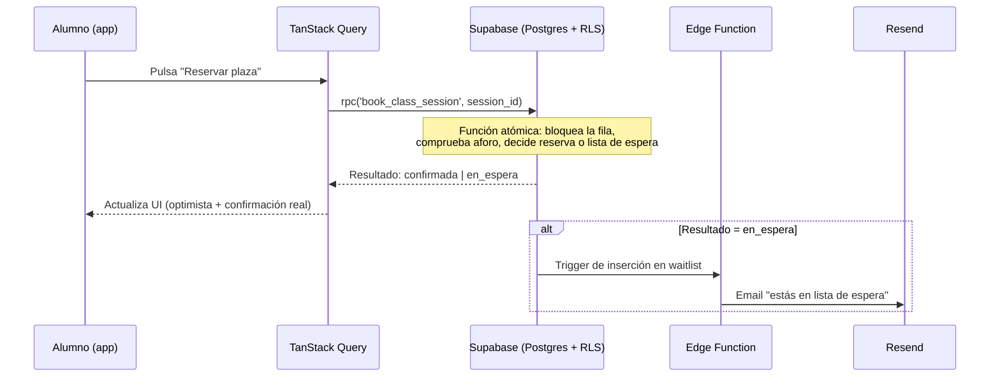

# ARCHITECTURE.md

## Resumen del stack

| Capa | Elección | Alternativas consideradas |
|---|---|---|
| Frontend | React 18 + TypeScript + Vite | Next.js, Vue |
| Empaquetado móvil/tiendas | Capacitor | PWA pura, React Native/Expo |
| Estilos | Tailwind CSS | CSS Modules, styled-components |
| Backend / BaaS | Supabase (Postgres + Auth + RLS + Storage + Edge Functions) | Firebase, backend propio (Node/Express) |
| Estado de servidor | TanStack Query | Llamadas manuales con useEffect, SWR |
| Estado de UI | React Context + useState/useReducer | Redux, Zustand |
| Formularios | React Hook Form + Zod | Formik, formularios sin librería |
| Validación | Zod (compartido cliente/servidor) | Yup, validación manual |
| Emails transaccionales | Resend + Supabase Edge Functions | SendGrid, Postmark, servicio de Supabase Auth por defecto |
| Hosting frontend | Vercel | Netlify, Cloudflare Pages |
| Testing | Vitest + React Testing Library + Playwright | Jest, Cypress |

Cada decisión se justifica abajo. La regla general: **elegimos lo más simple que resuelve el problema real de este proyecto**, no lo más popular ni lo más potente en abstracto.

---

## 1. Frontend: React + Vite + TypeScript (no Next.js)

Next.js aporta renderizado en servidor (SSR) y SEO de fábrica. Esas dos cosas importan cuando tienes contenido público que necesitas que Google indexe bien — una tienda online, un blog, una landing de marketing. Tu app es casi enteramente una herramienta que se usa **después de iniciar sesión**: nadie encuentra "reservar clase de boxeo martes 18:00" buscando en Google, encuentra el gimnasio de boca a boca o en redes y luego usa la app. El SEO no es el problema que hay que resolver aquí.

A cambio, Next.js añade conceptos que un desarrollador que empieza de cero tendría que aprender de golpe: Server Components vs Client Components, Server Actions, estrategias de caché propias del framework. React + Vite es el modelo mental más directo: "esto es una aplicación de una sola página, todo corre en el navegador, habla con Supabase por API". Es más fácil de razonar y depurar cuando estás aprendiendo, y sigue siendo exactamente lo que se usa en producción en miles de aplicaciones reales.

**Si en el futuro** el gimnasio quiere una web pública de marketing (información general, sin login, que necesite posicionar en Google), eso se plantea como un proyecto/sitio aparte — no justifica cambiar la arquitectura de la app de reservas.

## 2. Empaquetado móvil: Capacitor (no PWA pura, no React Native)

Dijiste que quieres llegar a Google Play (y potencialmente más tiendas) cuando el proyecto esté maduro. Esto descarta la opción de PWA pura como única solución, porque una PWA no aparece en las tiendas de aplicaciones aunque sea instalable desde el navegador.

Quedan dos caminos reales:

**React Native / Expo.** Construyes con un paradigma distinto a la web: en vez de `<div>` y CSS, usas `<View>`, `<Text>` y `StyleSheet`. El resultado es una app con sensación más nativa, pero:
- Aprendes un paradigma que no se transfiere directamente a "desarrollo web estándar" (lo cual sí te sirve para el resto de tu carrera como estudiante de DAM).
- Si además quieres que funcione como sitio web normal, necesitas React Native Web, que tiene sus propias limitaciones y no es tan directo como parece.

**Capacitor (elegido).** Construyes una aplicación web estándar (React + Vite, HTML/CSS/JS normal). Esa misma aplicación:
- Funciona como sitio web normal desde el primer día.
- Es instalable como PWA (Añadir a pantalla de inicio) sin ningún paso extra.
- Cuando decidas publicarla, Capacitor la empaqueta en un contenedor nativo (WebView) con acceso a APIs nativas reales (cámara, notificaciones push nativas, biometría si hiciera falta), lista para subir a Google Play o App Store, **sin reescribir la aplicación**.

El coste real de Capacitor: el rendimiento no es 100% nativo (corre en una WebView). Para una app de gestión de reservas (listas, formularios, calendarios) — no un juego ni algo con animación intensiva — esto no es una limitación perceptible.

## 3. Backend: Supabase (no Firebase, no backend propio desde ya)

Necesitas: base de datos con autenticación integrada, control transaccional estricto sobre el aforo, seguridad a nivel de datos, y nivel gratuito real.

**Firebase** (Firestore) es una base de datos NoSQL. Para un problema como "que no se reserve una plaza que no existe cuando dos personas reservan a la vez", necesitas transacciones reales con bloqueos a nivel de fila — Firestore lo permite de forma más limitada y menos natural que una base de datos relacional.

**Supabase** es Postgres real por debajo, con autenticación, Row Level Security (seguridad definida en la propia base de datos, no solo en el código de la app), Edge Functions (funciones de servidor) y almacenamiento de archivos, todo integrado. Al ser Postgres estándar:
- Podemos escribir una función SQL atómica que resuelve el problema del aforo de forma correcta (ver `DATABASE.md`, sección de concurrencia) — esto es exactamente lo que pediste cuando dijiste que había que "controlar al máximo" el aforo.
- Si el proyecto crece mucho y algún día se justifica un backend propio, migras de Postgres a Postgres — no de un modelo de datos propietario a uno relacional desde cero.

Backend propio (Node/Express + Postgres gestionado a mano) te daría el mismo control, pero también te obliga a construir tú mismo autenticación, recuperación de contraseña, verificación de email, gestión de sesiones y protección básica — todo esto ya viene resuelto y auditado en Supabase Auth. Para un desarrollador en solitario empezando de cero, no tiene sentido reconstruir esto ahora (YAGNI). El día que Supabase se quede corto (miles de usuarios simultáneos con necesidades muy específicas), el camino de migración es razonable precisamente porque es Postgres estándar.

## 4. Emails transaccionales: Resend + Supabase Edge Functions

Supabase Auth trae un envío de emails por defecto (verificación, recuperación de contraseña), pero está pensado solo para desarrollo/pruebas: el límite de envíos por hora es muy bajo para usarlo con alumnos reales.

**Resend** tiene un nivel gratuito de 3.000 emails/mes (con un límite de 100/día) — de sobra para un único gimnasio en el arranque — y se integra de forma directa con Edge Functions de Supabase. Lo usamos para:
- Emails de verificación de cuenta y recuperación de contraseña (configurando Supabase Auth para usar Resend como SMTP personalizado desde el principio, en vez del servicio de pruebas).
- Notificación de "has entrado en la clase" cuando la lista de espera te promociona.
- Notificación de cancelación de clase (ya sea porque el admin la cancela, o como confirmación al propio alumno cuando cancela su reserva).

Si el gimnasio creciera mucho y el volumen de emails se acercara al límite diario, el siguiente escalón (plan de pago de Resend) es barato y no requiere cambiar de proveedor ni de código.

## 5. Hosting: Vercel

Conecta directamente con GitHub: cada push a `main` se despliega automáticamente, y cada Pull Request genera una URL de preview para probar cambios antes de fusionarlos — un flujo de trabajo profesional real incluso trabajando en solitario. Netlify sería una alternativa igual de válida; Vercel se elige por ser el más pulido para proyectos Vite/React ahora mismo.

## 6. Estado: TanStack Query (no Redux)

Casi todo el "estado" de esta aplicación **es estado del servidor**: la lista de clases, tus reservas, tu perfil. TanStack Query está diseñado exactamente para esto: cachea las respuestas, revalida cuando hace falta, y gestiona automáticamente los estados de carga y error, ahorrando muchísimo código repetitivo frente a hacerlo a mano con `useEffect`.

Redux (o Zustand) resuelven un problema — estado de cliente complejo compartido entre muchos componentes — que esta app apenas tiene. Añadirlo ahora sería complejidad sin necesidad real (YAGNI). Si en el futuro aparece un estado de UI genuinamente complejo y compartido, Zustand sería la opción ligera a evaluar antes que Redux.

## 7. Formularios y validación: React Hook Form + Zod

Zod define un "esquema" de validación (por ejemplo: "el email debe tener formato de email, la fecha de nacimiento es obligatoria") que se puede compartir entre el frontend (validar antes de enviar) y las Edge Functions (validar otra vez en el servidor, porque **nunca te fías solo del cliente** — ver `SECURITY.md`). React Hook Form se apoya en ese mismo esquema para gestionar formularios con poco código repetitivo y buen rendimiento.

## 8. Estilos: Tailwind CSS

Los breakpoints de Tailwind son `min-width` — es decir, escribes el estilo base pensando en móvil y añades reglas para pantallas más grandes (`md:`, `lg:`), que es exactamente mobile-first. Además, activar un modo oscuro en el futuro es añadir la variante `dark:` sobre un sistema de colores ya centralizado (design tokens), no reescribir hojas de estilo.

## 9. Testing: Vitest + React Testing Library + Playwright

Vitest se integra de forma nativa con Vite (misma configuración, arranque instantáneo). React Testing Library para probar componentes desde la perspectiva del usuario (qué ve, qué puede hacer) en vez de detalles internos. Playwright para los flujos End-to-End críticos: registro, login, reservar una clase (incluyendo el caso de aforo lleno + lista de espera), cancelar. Detalle completo en `TESTING.md`.

---

## Estructura de carpetas

Organización **por funcionalidad** (feature-based), no por tipo técnico. La alternativa típica de "una carpeta `components/`, una carpeta `hooks/`, una carpeta `services/`" escala mal: para entender todo lo relacionado con "reservas" acabas saltando entre cinco carpetas distintas. Agrupar por funcionalidad significa que todo lo de "reservas" vive junto.

```
src/
  app/                      # Arranque de la aplicación: providers, rutas, layout raíz
    App.tsx
    router.tsx
    providers.tsx

  features/                 # Una carpeta por funcionalidad de negocio
    auth/
      components/           # LoginForm, RegisterForm...
      hooks/                # useAuth, useSession...
      api/                  # Llamadas a Supabase relacionadas con auth
      types.ts
    classes/                # Clases y horarios (class_templates, class_sessions)
    bookings/                # Reservas y lista de espera
    trainers/                # Perfiles de entrenadores
    dependents/               # Gestión de hijos/menores desde la cuenta del padre
    admin/                    # Panel de administración

  components/                # Componentes UI genéricos y reutilizables (Button, Input, Modal, Card...)
  lib/                        # Configuración de librerías externas (cliente de Supabase, queryClient)
  hooks/                       # Hooks genéricos compartidos entre features (useDebounce, useMediaQuery...)
  types/                        # Tipos TypeScript globales compartidos
  utils/                         # Funciones puras sin dependencias (formateo de fechas, etc.)
  styles/                         # Estilos globales y tokens de diseño (colores, tipografía)

supabase/
  migrations/                 # Historial versionado del esquema de base de datos (SQL)
  functions/                   # Edge Functions (lógica de servidor: reservas atómicas, envío de emails)

tests/
  e2e/                          # Tests Playwright de flujos completos
```

Regla de alias de imports (ver `CODE_STYLE.md`): siempre `@/features/bookings/...`, nunca `../../../features/bookings/...`.

## Flujo de datos: ejemplo de una reserva



Cuando alguien cancela y libera una plaza, el mismo patrón se repite pero en dirección contraria: la función de cancelación promociona automáticamente al primero de la lista de espera dentro de la misma transacción (detalle completo en `DATABASE.md`).

## Roadmap de escalabilidad (cuándo revisar estas decisiones)

- **Supabase → backend propio:** revisar si el proyecto supera con holgura el plan Pro y las necesidades de lógica de servidor superan lo razonable para Edge Functions (que están pensadas como "lógica pegamento", no como un backend completo).
- **Vercel free → Pro:** cuando el tráfico o el número de builds lo justifique (no es un riesgo a corto plazo).
- **Resend free → Pro:** cuando el volumen de emails se acerque de forma sostenida al límite mensual/diario.
- **Capacitor → evaluar necesidad real de app 100% nativa:** solo si en algún momento se necesitan capacidades que una WebView no puede dar (rendimiento gráfico intensivo, por ejemplo) — muy improbable para este tipo de app.

Cualquier decisión que se tome sobre estos puntos (o cualquier otra no prevista aquí) se documenta en `DECISIONS.md`, no se cambia en silencio.
