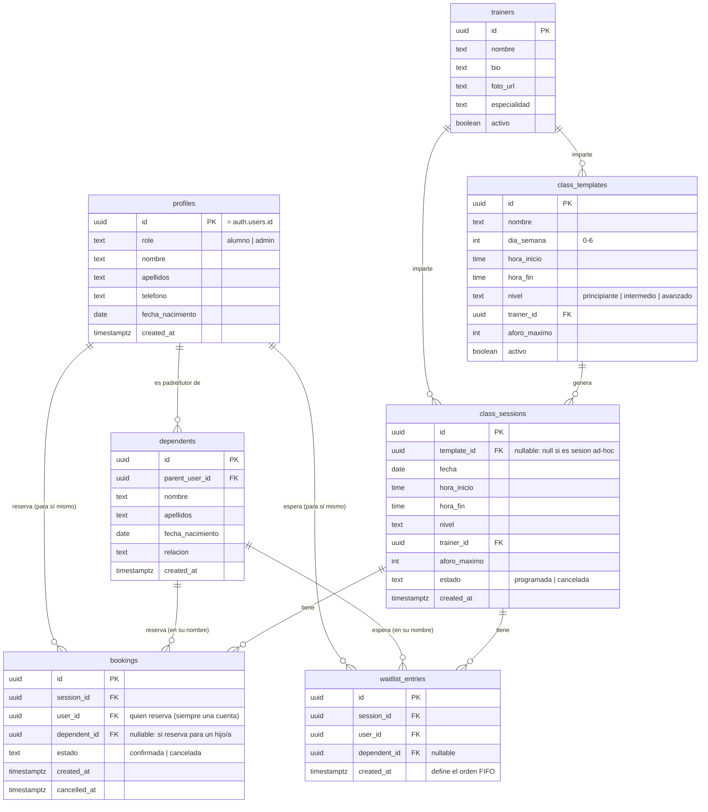

# DATABASE.md

Motor: **PostgreSQL** (vía Supabase). Todo lo de aquí asume que ya conoces `ARCHITECTURE.md`.

## Diagrama de relaciones



## Por qué el modelo separa `class_templates` de `class_sessions`

Confirmaste que el admin podrá crear clases, aunque lo normal es que sean fijas/recurrentes. Un único modelo no cubre bien ambos casos, así que separamos:

- **`class_templates`** describe el horario recurrente ("Boxeo Nivel 1, lunes y miércoles 18:00"). No es una clase concreta reservable — es la plantilla.
- **`class_sessions`** son las instancias concretas y reservables ("Boxeo Nivel 1, lunes 20 de julio de 2026, 18:00"). Se generan automáticamente a partir de las plantillas activas (una función programada crea las próximas 4 semanas de sesiones, de forma continua), y el admin puede además:
  - Crear una sesión suelta sin plantilla (`template_id = null`) para un evento especial.
  - Cancelar una sesión concreta generada (festivo, entrenador de baja) sin tocar la plantilla ni afectar al resto de semanas.

Esto te da lo mejor de ambos mundos: el admin no tiene que crear cada semana manualmente, pero conserva control total sobre cualquier sesión individual.

## El problema del aforo: por qué "comprobar y luego insertar" NO es seguro

La forma ingenua de reservar sería: "cuento cuántas reservas confirmadas hay, si son menos que el aforo máximo, inserto una nueva". El problema es que si dos alumnos pulsan "reservar" para la última plaza en el mismo instante, **ambas peticiones pueden hacer la cuenta antes de que ninguna haya insertado nada** — las dos ven "hay hueco" y las dos insertan, y acabas con más reservas confirmadas que aforo. Esto se llama una condición de carrera (race condition), y es precisamente lo que pediste evitar "al máximo".

La solución no es "tener cuidado en el código de la aplicación" — el código de la aplicación no puede garantizar esto por sí solo, porque dos peticiones distintas se ejecutan en paralelo sin verse la una a la otra. La solución vive **en la base de datos**, en una única operación atómica.

### La función: `book_class_session`

En vez de que el frontend haga "leer aforo → decidir → insertar" en varios pasos, todo eso ocurre dentro de **una sola función de Postgres**, invocada como una única llamada (`supabase.rpc('book_class_session', ...)`). Postgres garantiza que, mientras esa función se ejecuta para una fila concreta, ninguna otra transacción puede modificar esa misma fila a la vez — así que dos alumnos reservando la última plaza a la vez quedan **en fila**, no en paralelo, y solo uno de los dos gana la plaza.

Boceto conceptual (simplificado, la versión final se revisa en la fase de implementación siguiendo `TASK_WORKFLOW.md`):

```sql
create or replace function book_class_session(
  p_session_id uuid,
  p_dependent_id uuid default null
)
returns table (resultado text) -- 'confirmada' | 'en_espera'
language plpgsql
security definer
as $$
declare
  v_aforo int;
  v_ocupadas int;
begin
  -- Bloquea la fila de la sesión hasta que termine esta transacción.
  -- Cualquier otra llamada a esta función para la MISMA sesión espera aquí.
  select aforo_maximo into v_aforo
  from class_sessions
  where id = p_session_id
  for update;

  select count(*) into v_ocupadas
  from bookings
  where session_id = p_session_id and estado = 'confirmada';

  if v_ocupadas < v_aforo then
    insert into bookings (session_id, user_id, dependent_id, estado)
    values (p_session_id, auth.uid(), p_dependent_id, 'confirmada');
    return query select 'confirmada';
  else
    insert into waitlist_entries (session_id, user_id, dependent_id)
    values (p_session_id, auth.uid(), p_dependent_id);
    return query select 'en_espera';
  end if;
end;
$$;
```

El `for update` es la pieza clave: convierte "comprobar y luego actuar" en una sola operación indivisible desde el punto de vista de cualquier otra petición concurrente.

### Cancelación + promoción automática de lista de espera

Mismo principio: cancelar una reserva y promocionar al siguiente de la lista de espera ocurre en **una sola función atómica** (`cancel_booking`), no en dos pasos separados — si no fuera atómico, existiría una ventana de tiempo en la que la plaza parece libre para una reserva nueva justo cuando también se está promocionando a alguien de la lista de espera, y podrías volver a tener el mismo problema de duplicidad.

Flujo dentro de la función:
1. Marca la reserva como `cancelada` (`cancelled_at = now()`).
2. Si la clase es dentro de más de 1 hora (regla de negocio confirmada), permite la cancelación; si no, la rechaza.
3. Busca en `waitlist_entries` la entrada más antigua (`order by created_at asc limit 1`) para esa `session_id`.
4. Si existe, la convierte en `bookings` con estado `confirmada` y la borra de la lista de espera.
5. Dispara el email correspondiente (ver `ARCHITECTURE.md`, Edge Functions + Resend): al alumno que cancela, confirmación; al promocionado (si lo hay), aviso de que ha entrado en la clase.

## Row Level Security (RLS): resumen de políticas

Detalle de "quién puede ver/hacer qué" en `SECURITY.md`. Resumen aplicado a cada tabla:

| Tabla | Lectura | Escritura |
|---|---|---|
| `profiles` | El propio usuario su fila; admin todas | El propio usuario su fila; admin todas |
| `dependents` | El padre/madre sus dependientes; admin todos | El padre/madre sus dependientes; admin todos |
| `trainers` | Cualquier usuario autenticado | Solo admin |
| `class_templates` | Cualquier usuario autenticado | Solo admin |
| `class_sessions` | Cualquier usuario autenticado | Solo admin (crear/cancelar) |
| `bookings` | El propio usuario sus reservas (incluyendo las de sus dependientes); admin todas | El propio usuario (crear/cancelar las suyas y las de sus dependientes) vía las funciones atómicas; admin todas |
| `waitlist_entries` | Igual que `bookings` | Igual que `bookings`, siempre vía función |

Importante: las escrituras en `bookings` y `waitlist_entries` **no se hacen con un INSERT directo desde el cliente** — se hacen siempre a través de `book_class_session` / `cancel_booking`, precisamente para que la lógica de aforo/concurrencia no se pueda saltar. RLS impide además el INSERT/UPDATE directo sobre esas tablas desde el cliente.

## Índices

- `class_sessions (fecha, estado)` — la consulta más frecuente es "sesiones futuras no canceladas", filtrar rápido por esto importa desde el día 1.
- `bookings (session_id, estado)` — para contar reservas confirmadas de una sesión (usado dentro de `book_class_session`).
- `bookings (user_id)` y `bookings (dependent_id)` — para que un alumno vea rápido "mis reservas" y "las de mi hijo/a".
- `waitlist_entries (session_id, created_at)` — el orden FIFO depende directamente de este índice.

## Notas sobre menores (`dependents`)

Un menor **no tiene cuenta propia** (confirmado). Su relación con el sistema es siempre a través de `parent_user_id`. Cuando un padre/madre reserva "para su hijo", el `booking` guarda `user_id` (quién hizo la acción, siempre una cuenta real y autenticada) y `dependent_id` (para quién es la plaza). Esto mantiene la trazabilidad de responsabilidad (quién reservó) separada de a quién beneficia la reserva — relevante también para RGPD/LOPDGDD (ver `SECURITY.md`).
